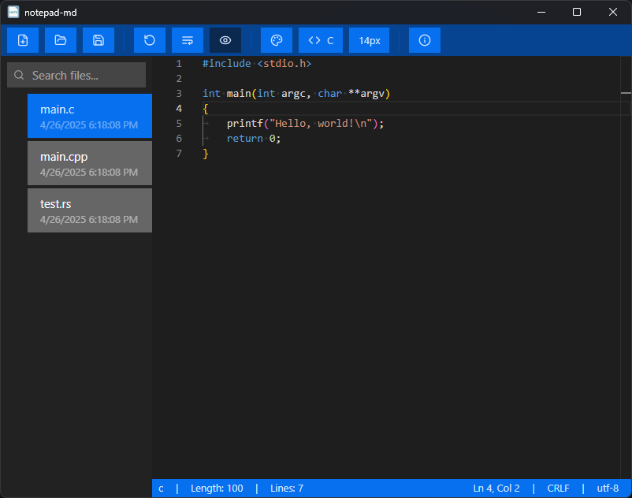
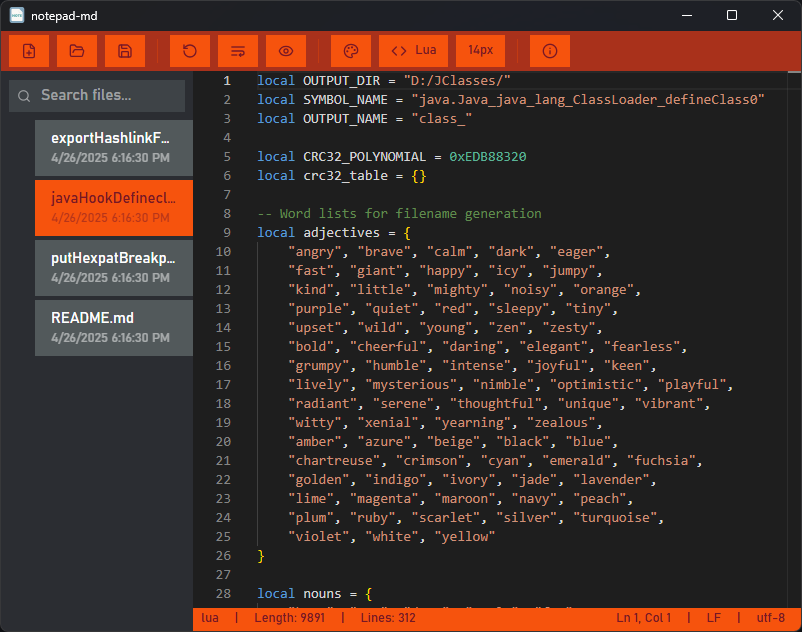
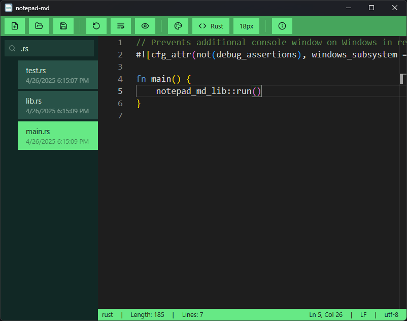

# notepad-md

Simple notepad based on monaco editor

    
    
    

## Features

- [x] Monaco editor
- [x] File Drag&Drop support
- [x] Status bar: language, length, lines, cursor position, line endings, encoding
- [x] Search bar for files
- [x] Keep opened files
- [x] Keep recent files
- [x] Themes
- [x] Restore closed file(s)
- [x] Word wrap
- [x] Show/hide space characters
- [x] Keyboard shortcuts
- [ ] Encodings
- [ ] Save cursor position

## Keyboard Shortcuts

| Action | Shortcut |
|--------|----------|
| New | Ctrl+N |
| Open | Ctrl+O |
| Save | Ctrl+S |
| Save as | Ctrl+Shift+S |
| Rename | F2 |
| Close | Ctrl+W |
| Restore | Ctrl+Shift+T |
| Word wrap | Alt+Z |

Download [here](https://github.com/FirowMD/notepad-md/releases)